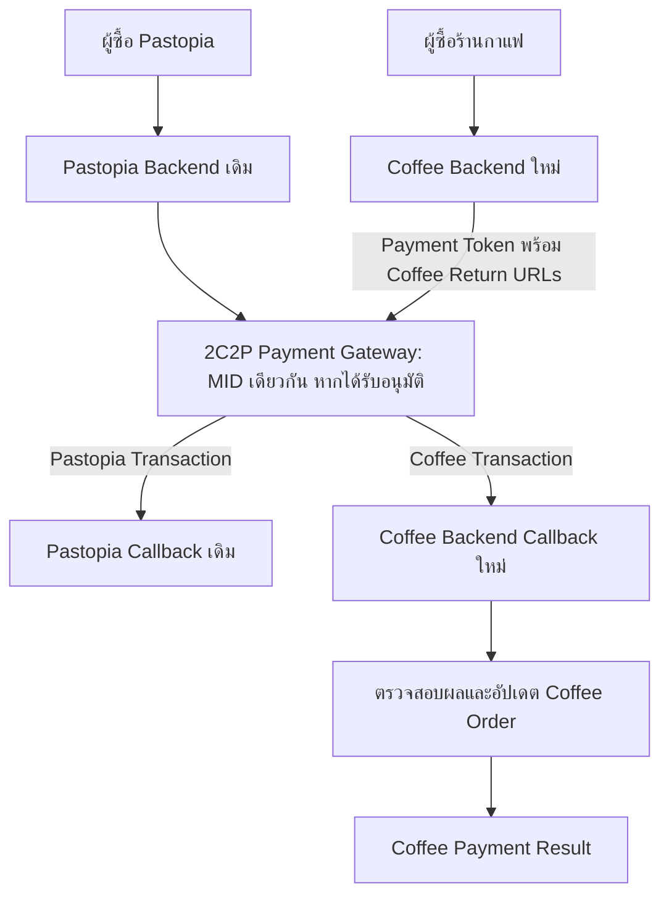

# SPEC: ทดสอบ 2C2P Payment สำหรับเว็บไซต์ร้านกาแฟ

**สถานะ:** Draft / Proof of Concept (POC)  
**ภาษา:** ไทย  
**เป้าหมาย:** เพิ่มระบบชำระเงินให้เว็บไซต์ร้านกาแฟที่มีอยู่แล้ว โดยไม่กระทบ Pastopia

## 1. ขอบเขตและข้อห้าม

- Pastopia ใช้งาน 2C2P อยู่แล้ว และ **ห้ามแก้โค้ด, ฐานข้อมูล, Deployment หรือ Payment Flow ของ Pastopia**
- **ห้ามแก้ Payment Result URL ใน 2C2P Merchant Portal** ซึ่งตั้ง Default Frontend/Backend URL ของ Pastopia อยู่
- ร้านกาแฟต้องใช้ Frontend Return URL และ Backend Return URL ของตัวเอง **ไม่ส่งผลชำระเงินไปยัง Pastopia**
- ต้องการทดลองใช้ MID เดิมภายใต้นิติบุคคลเดิม แต่ **ต้องได้รับการยืนยันจาก 2C2P ก่อนว่า MID นี้อนุญาตให้รับชำระสำหรับร้านกาแฟ/เว็บไซต์ใหม่**
- ใช้เว็บไซต์ร้านกาแฟเดิม ตรวจสอบ Framework และโครงสร้างก่อนแก้ไข ห้ามเขียนทับส่วนที่ไม่เกี่ยวข้อง
- ห้ามใช้ Production Keys ทำธุรกรรมเงินจริงโดยไม่ได้รับอนุญาต เริ่มจาก Mock และ Sandbox ก่อน

## 2. ข้อมูลที่ทราบและสิ่งที่ต้องตรวจสอบ

| รายการ | ค่า/เงื่อนไข |
|---|---|
| Payment Provider | 2C2P |
| MID ที่ใช้งานกับ Pastopia | `764764000017567` (Production; ใช้เป็นข้อมูลอ้างอิง ไม่ใช่ Sandbox MID) |
| Merchant Portal Default Frontend URL | `https://pay-lnv.pastopia.io/callback/frontend` (ห้ามแก้) |
| Merchant Portal Default Backend URL | `https://pay-lnv.pastopia.io/callback/backend` (ห้ามแก้) |
| ช่องทางที่เห็นใน Portal | CC, TrueMoney (การใช้จริงขึ้นกับการเปิดใช้งาน) |
| Coffee Frontend URL | กำหนดผ่าน environment |
| Coffee Backend URL | กำหนดผ่าน environment |
| API Version | ตรวจสอบเวอร์ชันและรูปแบบการเชื่อมต่อที่ใช้จริงจากเอกสาร 2C2P |

> **สำคัญ:** ภาพหน้าจอก่อนหน้ามี Secret Keys ปรากฏอยู่ ห้ามคัดลอกลงโค้ด, Prompt, Log หรือ Git และให้ผู้ดูแลประสาน 2C2P เพื่อหมุนเวียนคีย์อย่างปลอดภัย โดยไม่ทำให้ Pastopia หยุดทำงาน

## 3. Architecture



**เงื่อนไขการออกแบบ:** ต้องยืนยันว่า Payment Token API รุ่นที่ใช้งานรองรับการกำหนด `frontendReturnUrl` และ `backendReturnUrl` ต่อธุรกรรม และใช้ค่าที่ส่งมาแทน Default ใน Portal หากไม่รองรับ ให้หยุด Integration และรายงาน ไม่แก้ Portal หรือส่ง Callback ผ่าน Pastopia เป็นทางลัด

## 4. Functional Requirements

### FR-01 ตรวจสอบเว็บไซต์เดิม

- วิเคราะห์ Framework, Routing, Backend, Database, Auth, สินค้า, ตะกร้า และ Checkout
- ใช้ระบบเดิมให้มากที่สุด ไม่สร้างบริการซ้ำโดยไม่จำเป็น
- ก่อนแก้ไข ให้สรุปแผนและรายชื่อไฟล์ที่กระทบ

### FR-02 Checkout

- สร้างหรือใช้ Order เดิมจากรายการสินค้าในร้านกาแฟ
- คำนวณราคาและยอดชำระ **ฝั่ง Server** เท่านั้น
- สร้าง `invoiceNo` ที่ไม่ซ้ำกันใน MID เดียวกัน เช่น `COFFEE-<ULID>`
- บันทึก Order เป็น `PENDING` ก่อนขอ Payment Token
- ป้องกันการสร้าง Payment ซ้ำจากการกดปุ่มซ้ำ

### FR-03 สร้าง Payment Token

- ใช้ API, การลงลายเซ็น/เข้ารหัส และฟิลด์ตามเอกสาร 2C2P เวอร์ชันที่ตรวจสอบแล้วเท่านั้น
- ส่ง `frontendReturnUrl` และ `backendReturnUrl` ของร้านกาแฟ **ทุกครั้ง** ใน Payment Token Request
- หาก URL ใดหายไปหรือไม่ใช่ HTTPS ที่อนุญาต ให้ปฏิเสธคำขอก่อนเรียก 2C2P
- ไม่รับ Callback URL อิสระจาก Browser; ใช้ URL ที่ตั้งไว้ใน Server Environment
- ห้ามใช้ URL ของ Pastopia เป็น Fallback

ตัวอย่างค่าตั้งต้น (ไม่ใช่ Payload API ฉบับสมบูรณ์):

```dotenv
PAYMENT_MODE=mock
TWO_C_TWO_P_MERCHANT_ID=
TWO_C_TWO_P_CREDENTIALS_PATH=
COFFEE_FRONTEND_RETURN_URL=https://coffee.example.com/payment/result
COFFEE_BACKEND_RETURN_URL=https://api.coffee.example.com/api/payments/2c2p/callback
```

> ชื่อและชนิดของ Credentials ให้ปรับตาม API จริง เก็บ Secret ใน Secret Manager หรือ `.env` ฝั่ง Server ที่ไม่ commit เท่านั้น

### FR-04 Backend Callback

- Endpoint ตัวอย่าง: `POST /api/payments/2c2p/callback` (ตรวจสอบ HTTP method และ Payload ตามเอกสารจริง)
- ตรวจสอบความถูกต้องของ Notification ตามมาตรฐาน 2C2P เวอร์ชันที่ใช้งาน
- ตรวจสอบ MID, Invoice, Amount, Currency และ Transaction Reference เทียบกับ Order ที่บันทึกไว้
- ป้องกัน Replay และรองรับ Idempotency: Callback ซ้ำต้องไม่ทำให้ตัดสต็อก/ส่งคำสั่งซื้อซ้ำ
- อัปเดตสถานะตามผลที่ตรวจสอบแล้ว และจัดเก็บ Audit Log โดยไม่บันทึก Secrets หรือข้อมูลบัตร
- หาก Callback ไม่มา ต้องมีแนวทางตรวจสอบสถานะผ่าน API ที่ 2C2P รองรับ (ถ้ามี) โดยไม่เดาว่าสำเร็จ

### FR-05 Frontend Return

- URL ตัวอย่าง: `/payment/result`
- แสดงสถานะจาก Backend (`PENDING`, `PAID`, `FAILED`, `CANCELLED`, `EXPIRED`)
- **ห้ามถือว่า Redirect กลับหน้าเว็บแปลว่าชำระเงินสำเร็จ**
- รองรับผู้ใช้ปิดหน้าเว็บก่อน Callback มาถึง และการ Refresh หน้า Result

## 5. API ภายในที่เสนอ

| Method | Path | หน้าที่ |
|---|---|---|
| POST | `/api/payments/create` | ตรวจสอบ Order และสร้าง Payment Token |
| POST | `/api/payments/2c2p/callback` | รับผลจาก 2C2P (ปรับ Method ตาม API จริง) |
| GET | `/api/payments/:orderId/status` | อ่านสถานะ Order จาก Backend โดยตรวจสิทธิ์ |
| GET | `/payment/result` | หน้าแสดงผลการชำระเงิน |

## 6. ข้อมูลที่ควรจัดเก็บ

- `orders`: id, invoice_no (unique), items, amount, currency, status, created_at, updated_at
- `payments`: id, order_id, provider, provider_transaction_id, status, timestamps
- `payment_events`: event/reference, order_id, event_type, received_at, verification_result (ไม่มี Secret)
- สถานะต้องมี State Transition ที่ชัดเจน และใช้ Transaction/Lock เมื่ออัปเดตเพื่อกัน Race Condition

## 7. Test Plan

**ลำดับการทดสอบ:** Unit/Mock → Sandbox (Sandbox MID และ Keys จริง) → Production เฉพาะเมื่อได้รับอนุมัติ

| ID | Test Case | ผลที่คาดหวัง |
|---|---|---|
| T01 | สร้าง Order ร้านกาแฟ | ได้ Invoice ไม่ซ้ำและสถานะ PENDING |
| T02 | สร้าง Payment Token | Request มี Coffee Frontend/Backend URLs |
| T03 | ไม่ตั้ง Coffee Callback URL | Backend ปฏิเสธก่อนเรียก 2C2P |
| T04 | Payment Success | ยืนยันผลแล้วอัปเดต PAID |
| T05 | Payment Failed/Cancelled | แสดงสถานะถูกต้อง |
| T06 | Callback ซ้ำ | ไม่อัปเดต/ดำเนินการซ้ำ |
| T07 | Signature/Invoice/Amount ไม่ตรง | ปฏิเสธและบันทึกเหตุการณ์ปลอดภัย |
| T08 | Redirect ก่อน Backend Callback | แสดง PENDING จนกว่าจะยืนยันผล |
| T09 | ตรวจสอบ URL ที่เรียกจริง | Coffee Callback ไป Coffee Backend เท่านั้น |
| T10 | Regression | ไม่มีการแก้ไขหรือกระทบ Pastopia |

## 8. Acceptance Criteria

- [ ] เว็บไซต์ร้านกาแฟเดิมใช้งานได้ตามปกติ
- [ ] ไม่มีการแก้ไข Source Code หรือ Deployment ของ Pastopia
- [ ] ไม่มีการเปลี่ยน Payment Result URL ใน Merchant Portal
- [ ] ทุก Coffee Payment Token ระบุ Coffee Frontend/Backend Return URLs ครบ
- [ ] ทดสอบได้ว่า Coffee Callback ไม่วิ่งเข้า Pastopia
- [ ] Callback ผ่านการตรวจสอบความถูกต้องก่อนอัปเดต Order
- [ ] ไม่ใช้ Production Keys ใน Mock/Sandbox และไม่เปิดเผย Secrets
- [ ] มี Test Report, `.env.example`, ขั้นตอน Run/Deploy และรายการข้อจำกัดที่ยังต้องยืนยัน

## 9. สิ่งที่ต้องยืนยันกับ 2C2P ก่อนเปิดใช้งานจริง

1. MID เดิมสามารถใช้กับเว็บไซต์ร้านกาแฟ/ประเภทสินค้าใหม่ได้หรือไม่ และต้องลงทะเบียนเว็บไซต์เพิ่มหรือไม่
2. API Version/Integration ปัจจุบันรองรับ Return URL Override ต่อ Payment Token หรือไม่ รวมถึงข้อจำกัดของช่องทางชำระเงินแต่ละประเภท
3. มีการจำกัด Allowed Callback Domains หรือจำเป็นต้อง Whitelist โดเมนใหม่หรือไม่
4. วิธีรับ Sandbox MID/Keys และขั้นตอนทดสอบที่ไม่กระทบ Production
5. ผลกระทบต่อ Settlement, Refund, Reconciliation และ Reporting เมื่อใช้ MID เดียวกัน

## 10. คำสั่งสำหรับ Claude Code

1. อ่านไฟล์นี้และสำรวจ Repository ก่อน
2. สรุป Architecture ปัจจุบัน, Gap Analysis และ Implementation Plan
3. ตรวจสอบเอกสารทางการ 2C2P ที่ตรงกับ Integration; ถ้าเข้าถึงไม่ได้ ให้ระบุส่วนที่ยังยืนยันไม่ได้ ห้ามเดา
4. ลงมือพัฒนาเฉพาะ Coffee Shop ตามแผน โดยเริ่มที่ Mock Mode
5. สร้าง/รัน Tests และรายงานผลพร้อมรายการไฟล์ที่เปลี่ยน
6. ห้ามแก้ Pastopia, Merchant Portal, Production Credentials หรือทำธุรกรรมเงินจริงโดยไม่ได้รับอนุญาต
